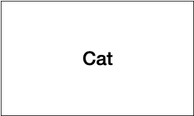
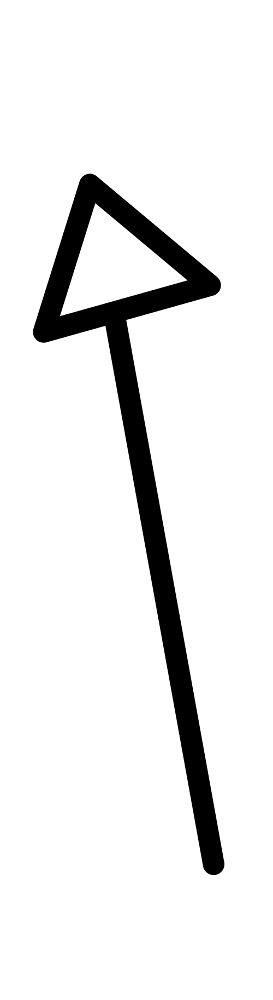

# Class Diagram
클래스 다이어그램은 디자인 패턴을 이해하는데 도움이 되는 기본 개념으로 엔지니어링의 청사진으로 볼 수 있다. 
이는 UML의 하위 개념으로 이해할 수 있다.

클래스 다이어그램에는 클래스, 프로토콜, 프로퍼티, 메소드 등의 관계가 포함된다.

상자는 클래스를 나타낸다.

오픈된 화살표는 상속을 의미한다.

이 상속은 ~이다 라고 읽으면 쉽게 이해할 수 있다.

예를들어

이런 클래스 다이어 그램이라면
한국 토종 -> 고양이 라고 읽으면 이해하기 쉽다.

그다음은 닫힌 화살인데 이는 프로퍼티를 나타낸다. UML로 보자면 association (연관)이다.

프로퍼티는 가지고 있다 라고 해석하면 된다.
아래 클래스 다이어 그램을 보면

`집사`는 `고양이`를 가지고 있다. 라고 읽을 수 있다.

화살표 옆에 범위를 지정해서 일대다 관계를 나타낼 수도 있다.

프로토콜은 클래스와 마찬가지로 상자로 표현하는데 차이점을 주기위해 `<<protocol>>`이라고 표시해준다.
그리고 프로토콜을 채용한 클래스의 관계는 열린 점선으로 표시한다

그다음은 UML용어로 `종속성`이라고 하는 `사용`을 나타내는 기호인 점선 닫힌 화설표이다.

UML의 경우 종속성이 무엇인지 구체적이지 않으므로 해당 화살표를 사용할 때는 주석을 표시하여 목적을 나타낸다. 예를 들어 종속성 화살표를 사용하여 다음 사항을 나타낸다.
- 약한 참조, Delegate
- 매개 변수로 메서드에 전달되지만 속성으로 유지되지 않는 개체
- 뷰 컨트롤러에서 `IBAction`과 같은 느슨한 결합 또는 콜백

전체적으로 보면 이런 느낌이다.

