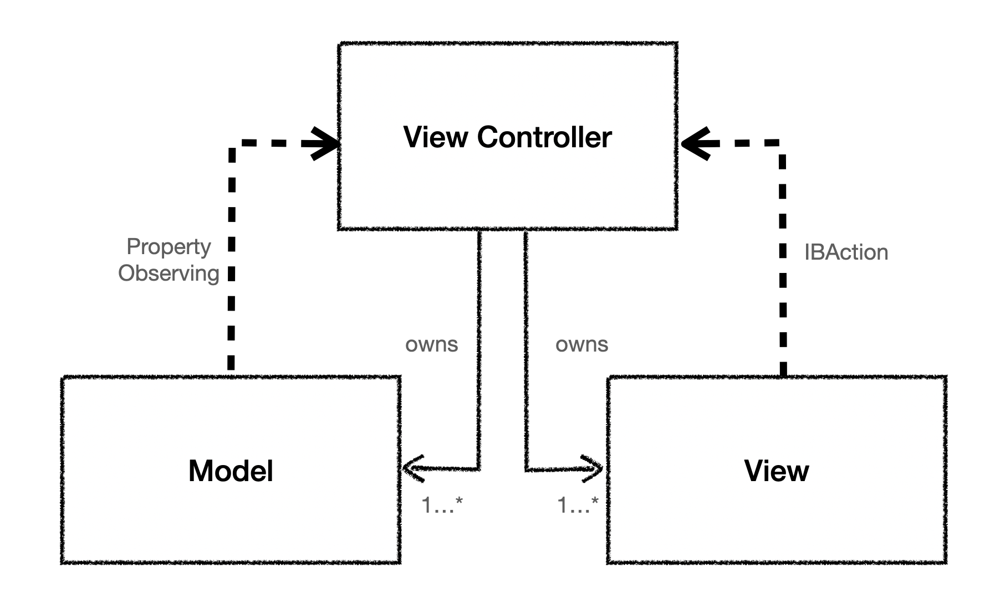
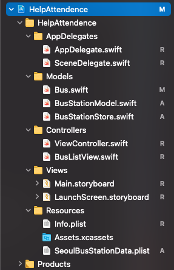
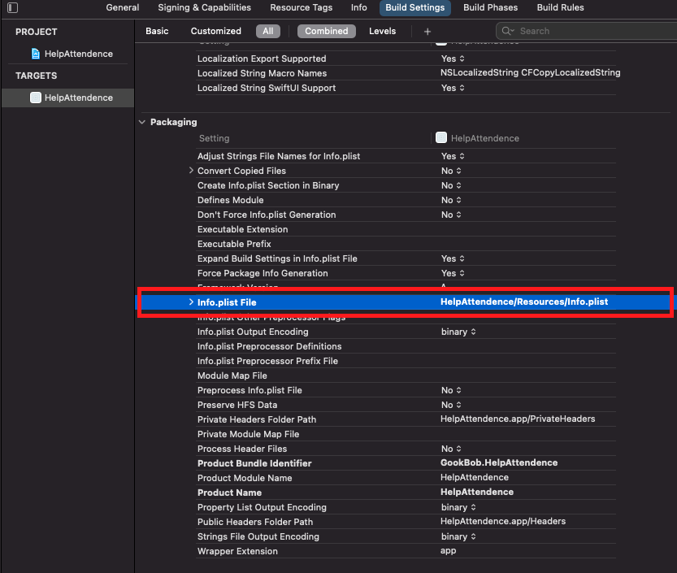

# Index
- [Structural design pattern](#structural-design-pattern)
- [MVC Pattern](#mvc-model-view-controller-pattern)
# Structural design pattern
물체를 어떻게 구성하고 결합하여 더 큰 구조를 형성하는지에 대한 디자인 패턴을 뜻한다.
대표적으로 `MVC`, `MVVM`, `Facade`가 있다.

<br></br>
# MVC(Model-View-Controller)Pattern
MVC패턴은 객체를 세 가지 유형으로 구분한다. `Model`, `View`, `Controller`이다.
클래스 다이어그램으로 보면 아래와 같은 모양세를 하고 있다.
([클래스 다이어 그램](../ClassDiagram/README.md))


- `Model`은 애플리케이션의 데이터를 보유한다. 일반적으로 구조체 또는 클래스를 의미한다.
- `View`는 화면에서 시작적 요소와 컨트롤을 표시한다. 흔히 아는 iOS의 경우 `UIView`를 들 수 있겠다.
- `Controller`는 모델과 뷰들 중가에서 컨트롤 하는데 iOS에서 `UIViewController`가 이에 해당하겠다.

MVC패턴은 UIKit에서 채택한 디자인 패턴이기 때문에 UIKit으로 어플리케이션을 만든다면 아주 일반적인 모습이다.

`Controller`는 모델과 뷰의 프로퍼티에 대해 `강하게`가지고 있을 수 있으나 모델과 뷰는 컨트롤어에 대해 강한 참조를 하면 안된다. 이럴 경우 순환참조가 발생한다.

UIKit에서 이를 해결하기 위해 모델은 프로퍼티 옵저빙, 뷰에서는 IBAction으로 컨트롤러와 통신한다.

UIKIt으로 앱 개발을 해보면 알겠지만 컨트롤러는 작업이 매우 구체적이기 때문에 재사용하기가 어렵다. MVC는 재사용성이 떨어진다고 볼 수도 있다.

<br></br>

```Swift
//lisence Raywenderlich
import UIKit

//MARK: - Address (Model)
public struct Address {
  public var street: String
  public var city: String
  public var state: String
  public var zipCode: String
}

//MARK: - AddressView (View)
public final class AddressView: UIView {
  @IBOutlet public var streetTextField: UITextField!
  @IBOutlet public var cityTextField: UITextField!
  @IBOutlet public var stateTextField: UITextField!
  @IBOutlet public var zipCodeTextField: UITextField!
}

//MARK: -  AddressViewController
public final class AddressViewController: UIViewController {

  // MARK: - Properties
  public var address: Address? {
    didSet {
      updateViewFromAddress()
    }
  }
  public var addressView: AddressView! {
    guard isViewLoaded else { return nil }
    return (view as! AddressView)
  }
  
  public override func viewDidLoad() {
    super.viewDidLoad()
    updateViewFromAddress()
  }
  
  private func updateViewFromAddress() {
    guard let addressView = addressView, let address = address else { return }
    addressView.streetTextField.text = address.street
    addressView.cityTextField.text = address.city
    addressView.stateTextField.text = address.state
    addressView.zipCodeTextField.text = address.zipCode
  }
  
  @IBAction public func updateAddressFromView(_ sender: AnyObject) {
    guard let street = addressView.streetTextField.text, street.count > 0,
          let city = addressView.cityTextField.text, city.count > 0,
          let state = addressView.stateTextField.text, state.count > 0,
          let zipCode = addressView.zipCodeTextField.text, zipCode.count > 0 else {
      return
    }
    address = Address(street: street, city: city, state: state, zipCode: zipCode)
  }
}
```
Address 모델과, AddressView 뷰, AddressViewController 컨트롤러가 있다.
컨트롤러는 모델과 뷰를 소유하고 이 경우 컨트롤러가 뷰와 모델의 업데이트를 동시에 관리한다.

MVC패턴은 만능이 아니다. 모든 개체가 MVC 범주에 꼭 들어맞는 것은 아니며 경우에 따라서 다른 패턴을 들여와야 할 수도 있다. 또 컨트롤러가 뷰와 모델을 계속 소유하다 보니 컨트롤러가 과도하게 커져 수정 작업이 어려울 수 있다. 

UIKit 구성에서 파일을 MVC패턴에 맞추어 정리하자면 아래 사진과 같다.


>Info.plist가 이동 했을 때 이동한 위치를 새로 지정해 주어야 정상적으로 읽어올 수 있다.

