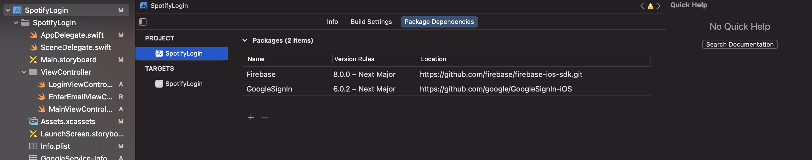

# Firebase Package Install

## 글 작성 목적
Intel Mac의 경우 원래 하던 방법대로 `cocoapods`를 이용해서 설치하면 된다. 본인의 경우 M1 MBP를 쓰고있는데 저번에는 Rosetta로 터미널 열고 하니까 됐었는데 이번에는 안된다. 

pod install 을 하면 ffi 라이브러리.rb에서 버그가 발생하는데 ffi를 뭐 설치를 해도 안되고 루비 자체를 업데이트 해도 안된다. 이것저것 하다보니 지금은 Rosetta gem은 깨져서 실행도 안된다. ㅋ

그래서 그냥 cocoapods 안쓰고 Swift Package Manager 쓰기로 했다.

다행인 것은 firebase가 깃헙 레포지토리가 있으므로 SPM으로 설치할 수 있다.

9월 17일인가 16일 부로 Xcode13 RC가 나왔고 나는 Dveloper Beta를 이미 쓰고 있었기 때문에 방법을 알고 있지만
막 12.5에서 올라온 사람은 헷갈릴 수 있을 것 같다.

## Swift Package Manager로 설치하기
Xcode12.5 에서는 Xcode-file-Packages로 가면 패키지 추가하기? 그런게 있었던거 같은데 Xcode13은 똑같은 메뉴로 가면 없다 패키지 캐시를 리셋하니, 패키지를 업데이트 하니 그런 내용밖에 없다.

Xcode13에서는 .App-프로젝트-pakage Dependencies에서 추가할 수 있다.

(패스트캠퍼스에서 따라 만들어 보고 있는 Spotify Login 페이지 이다.)

저기서 +버튼을 눌러서 패키지를 추가하면 된다.

[Firebase Github](https://github.com/firebase/firebase-ios-sdk.git)

자세한 내용은 [Firebase Developoer Docu](https://firebase.google.com/docs/ios/setup?authuser=0)