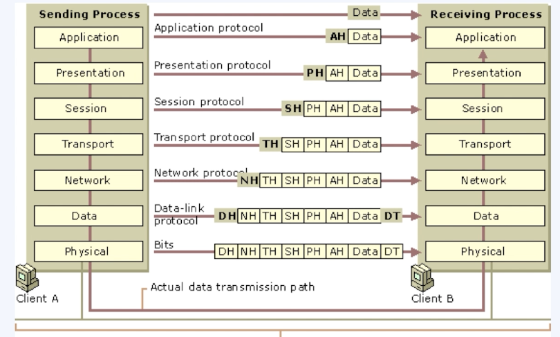
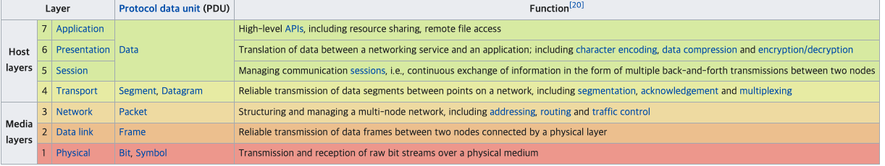

# OSI Model


각 계증에서는 해당하는 헤더를 붙이고 전달하는 과정을 캡슐화, 받는 과정에서 이를 헤더를 확인하고 푸는 부분을 디캡술화 라고 함


일반적인 iOS 개발자는 1~3(물리, 데이터, 네트워크)계층은 다룰일이 사실상 거의 없다고 한다. 이들 계층을 미디어 계층이라고 한다.

## Physical (물리계층) - Bits
물리적으로 연결하는 사양을 얘기함
- 전압레벨, 데이터 속도, 커넥터
- 케이블, 모뎀, 리피터 와 같은 물리 장치들이 이 물리 계층에 속함

## Data Link (데이터 계층) - Frames
- 데이터 오류 감지, 복구
- MAC 주소(NIC에 하드코딩된 고유한 주소)

## Network (네트워크 계층) - Packets
- 이 레벨은 각 네트워크의 엔드 포인트를 식별, 데이터 패킷을 전달하기 위해 아이피 주소와 같은 논리 주소를 정의함

## Transport (전송 계층) - Segments
- 데이터가 안정적으로 전달 될 수 있도록 제어, 받는 쪽에서 안정적으로 받도록 흐름 제어를 함
- TCP, UDP
  - TCP : 잘가고 있나,, 잘 받았니, 못받았네 와 같은 상태를 확인한다., 결과를 무조건 보장한다. (HTTP는 TCP기반)
  - UDP : 한번 보낸 뒤로는 확인하지 않음 받던 말던 관심 없음

## Session (세션 계층) - Data
- 통신 장치간의 상호작용 설정, 유지, 관리
- 로그인 한 상태에서 오프라인 상태가 유지되면 세션이 종료되었습니다 와 같은 문구를 본적이 있을 것!

## Presentation (표현 계층) - Data
- 7레벨에 적용되는 데이터 형식, 코딩, 변환 기능 (데이터의 암호화 도 포함)
- 파일 확장자

## Application (응용 계층) - Data
- 앱 상의 네트워크 : 앱에서 실제로 
- HTTP

# URL (Uniform Resource Locator)
- 네트워크 상에서 리소스가 어디있는지 알려주는 주소를 나타내는 규약
- 어떤 자원에는 반드시 매칭 되는 주소가 있다

## 구조
|구조|이름|설명|
|:-:|:-:|:-:|
|http://|프로토콜|
|www.naver.com|웹 서버명 -> DNS명 -> IP주소|네트워크 계층(3layer)|
|:8080|포트|전송 계층(4layer)|
|/index.html|데이터 리소스 경로|응용계층(7layer)

# HTTP
HTTP는 두가지 종류가 메시지 형태가 있다.
|메시지|역할|요소|
|-|-|-|
|Request|요청 내용|Method, URL, Header, Body|
|Response|요청에 대한 반응|StatusCode, Message, Header, Body|


## Request, Method
|명령|내용|
|-|-|
|Get|식별된 데이터 가져오기|
|Post|새 데이터를 추가|
|Put|기존 데이터 수정|
|Patch|데이터의 일부를 수정|
|Delete|데이터 삭제|
|Head|GET과 동일하지만 메시지 헤더만 반환|
|Connect|프록시 기능 요청|
|Options|웹서버에서 지원하는 메소드 확인|
|Trace|원격 서버 테스트용 메시지 확인|

- URL에 파라미터를 넣을 때 ?뒤에 넣게됨
- &도 있는데 이것은 파라미터 간의 구분자가 됨
```
http://ws.bus.go.kr/api/rest/stationinfo/getStationByName?serviceKey=<APIKEY>&stSrch=%EA%B0%80%EA%B3%A1%EC%B4%88%EA%B5%90
```
serviceKey와 stSrch라는 파라미터가 있는 GET Method

### Get, Post 차이
Get은 위와같이 파라미터가 URL상에 모두 노출된다.
Post는 전달해야할 내용을 URL에 넣지 않고 Body에 넣는다. URL은 200바이트 정도의 제한이 있지만 Body는 유동적으로 훨씬 크게 정할 수 있다. 대신 재현이 불가하고 북마크 등 공유가 불가능 하다.

## Response

### Status Code
[자세히보기](https://developer.mozilla.org/en-US/docs/Web/HTTP/Status)
|코드|정보|
|-|-|
|1xx|정보전달|
|2xx|성공 메시지, 요청한 요청에 대해 성공적인 수행으로|
|3xx|리다이렉션|
|4xx|클라이언트 에러|
|5xx|서버 에러|

# URL Session (in iOS)
- Apple 디바이스에서 네트워크 계층을 위한 방법
- HTTP를 포함한 7계층 프로토콜 내용을 포함하며, 네트워크 인증, 쿠기, 캐시 데이터 전반 
- TASK 그룹도 조정을 함

## URL Session 객체
- URL 로딩 시스템 : URL을 통해 상호작용 하고 서버와 통신하는 프로토콜
- URL Session은 이러한 로딩 시스템을 사용, 비동기식으로 동작!

일반적인 상황에서는 URL 싱글톤 인스턴스를 사용하기도 하고 좀더 복잡한 구성을 위해서는 `URLSessionCofiguration`을 사용할 수 있다.

|구성|내용|
|-|-|
|default|shared와 유사하게 동작함, 조금더 기능이 많음
|ephemeral|shard와 유사하지만, 캐시, 쿠키를 디스크에 쓰지 않음|
|background|앱이 실행되지 않는 상태에서도 데이터를 다운로드 할 수 있음|

## URL Session Task
- DataTask : NSData객체로 데이터 송수신 (단발성)
- UploadTask : 파일전송, 백그라운드 업로드 지원 (덩치가 비교적 큼)
- DownloadTask : 파일 형식 기반 데이터 검색, 백그라운드 다운로드 지원
- StreamTask
- WebSocketTask

## URL Session Life Cycle
URLSession -> URLSessionDataTask -> CompletionHandler