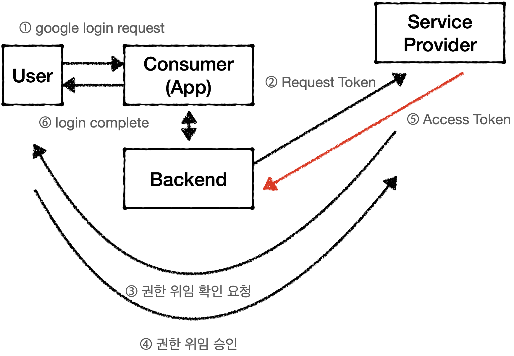

# OAuth란?
- 사용자 인증 방식에 대한 업계 표준
- ID/PW를 노출하지 않고 OAuth를 사용하는 업체의 API 접근 권한을 위임 받음
- 기본 개념
  1. *User* Service Provider에 계정을 가지고 있는 사용자
  2. *Consumer* Service Provider의 API를 사용하려는 서비스
  3. *Service* Provider OAuth를 사용하여 API를 제공하는 서비스
  4. Access *Token* 인증 완료 후 Service Provider의 제공 기능을 이용할 수 있는 권한을 위임받은 인증 키

