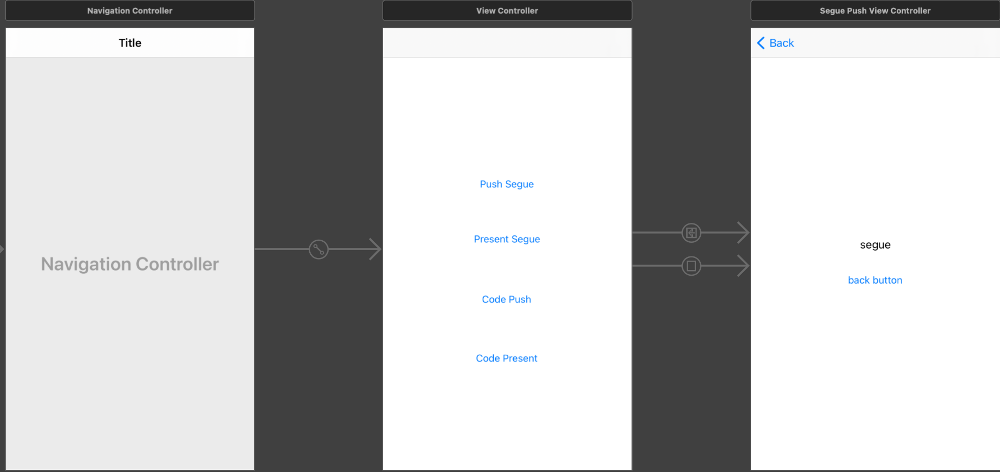
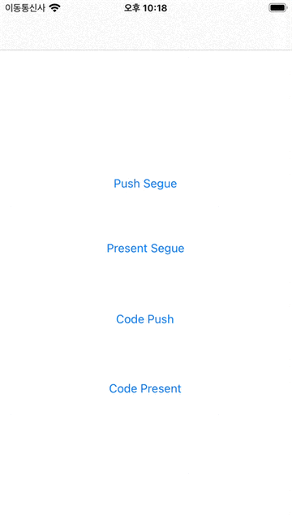

# View Controller 화면 전환 구현

View Controller간 화면 전환을 구현 하는 방법을 크게 나누면
1. `segue identifier`를 이용한 화면 전환
2. `storyboard identifier`를 이용한 화면 전환이 있다.

버튼 4개를 각각
- Push Segue
- Presnet Segue
- Push Code
- Present Code

이름으로 Root View Controller에서 만들고

다음 View Controller에서는 어떤 동작으로 지금 뷰로 넘어왔는지 표시하는 레이블과 이전 화면으로 돌아갈 수 있는 버튼 을 만든다. 이 중 Push의 경우 Navigation Stack에 해당하므로 RootView를 Navigation Controller로 Embed한다.


## 1. Push Segue
Push Segue는 Storyboard에서 PushSegue 버튼을 Right button Drag로 목적 ViewController에 끌어다 놓기만 하면 된다. 그러면 Segue가 생기는데
그 Segue의 `Attribute Inspector`에서 identifier에 `PushSegue`로 명명해보겠다.

그리고 타겟 VC로 넘어왔을 때 어떤 방법으로 넘어왔는지 표시하기 위해 새로운 VC코드를 생성한다.
```Swift
import UIKit

class DestinationViewController: UIViewController {
  
  @IBOutlet var segueTypeLabel: UILabel!
  
  var segueType: String!
  
  
  override func viewDidLoad() {
    super.viewDidLoad()
    
    segueTypeLabel.text = segueType
  }
  
  @IBAction func tapBackButton() {
    if segueType == "Push Segue" 
      self.navigationController?.popViewController(animated: true)
    }
  }
}
```
segueTypeLabel은 어떤 방식으로 넘어왔는지 표시할 레이블로 스토리보드에있는 label을 연결 해준다.
그리고 실제로 전달받을 segueType 문자열 변수를 선언하고 viewDidload에서 해당 내용을 segueTypeLabel로 대입해준다.

`TapBackButton`의 경우 네비게이션 스택으로 온 경우 상단 네비게이션 타이틀 바 쪽에 백 버튼이 생기지만 코드로도 뒤로가기 할 수 있으므로 구현한다.

그리고 RootViewController에서 Destination VC의 label에 데이터를 넘겨줘야 하므로 RootViewController의 코드는 아래와 같다.
```Swift
import UIKit

class ViewController: UIViewController {

  override func viewDidLoad() {
    super.viewDidLoad()
  }
  
  //use segue identifier
  override func prepare(for segue: UIStoryboardSegue, sender: Any?) {
    
    if segue.identifier == "PushSegue" {
      let controller = segue.destination as! DesitnationViewController
      controller.segueType = "Push Segue"
    }
  }
}
```
prepare라는 메소드를 이용하게 되는데 발생하는 segue를 감지하고 그 해당 segue의 ID를 캐치해서 데이터를 넘겨줄 수 있다.

<p></p>

## 2. Present Segue
Presnet Segue도 마찬가지로 RootViewController의 Presnet Segue 버튼을 Right Button Drag로 DestinationVC에 끌어다 놓는다.
그러면 생기는 Segue의 Attribute Inspector에서 idenfitifer를 `PresentSegue`로 명명한다.

그런다음 RootViewController에서는 아래와 같이 코딩해주면 된다.
```Swift
  //use segue identifier
  override func prepare(for segue: UIStoryboardSegue, sender: Any?) {        
    if segue.identifier == "PushSegue" {
      let controller = segue.destination as! DesitnationViewController
      controller.segueType = "Push Segue"
    }
    
    //Change This!!
    if segue.identifier == "PresentSegue" {
      let controller = segue.destination as! DesitnationViewController
      controller.segueType = "Present Segue"
    }
  }
  ```
  segue로 이동하는 방법이라 마찬가지로 prepare 메소드에서 작성해 준다. 이 경우 Navigatin View 로 이동한 것이 아니기 때문에 DestinationViewController에는 네비게이션 타이틀과 backbutton이 생기지 않는다. 기본적으로 `PopOver`(밑에서 카드 처럼 올라오는 폼)이므로 드래그 다운해서 원래 ViewController로 돌아올 수 있으나 이용자에게 확실한 방법을 제공해 주는것도 좋고 `FullScreen`으로 동작했을 때도 돌아올 수 있어야 하므로 back button에 기능을 구현해 주겠다.

  ```Swift
import UIKit

class DestinationViewController: UIViewController {
  
  @IBOutlet var segueTypeLabel: UILabel!
  
  var segueType: String!
  
  
  override func viewDidLoad() {
    super.viewDidLoad()
    
    segueTypeLabel.text = segueType
  }
  
  @IBAction func tapBackButton() {
    if segueType == "Push Segue"  {
      self.navigationController?.popViewController(animated: true)

      //Change this!!
    } else if segueType == "Present Segue" {
      self.presentingViewController?.dismiss(animated: true, completion: nil)
    } 
  }
}
```

## 3. Push Code
Push Code는 Push Segue와 마찬가지로 Navigation Push를 하는 방법으로 이번에는 Segue를 연결하지 않는 대신 VC의 StoryboardID를 이용한 방식으로 이동한다.

우선 `Destination View Controller`의 `Indentifier Inspector`에서 `Storyboard ID` 부분을 `DestinationViewController로` 명명한다.

그런 다음 RootViewController의 코드는 다음과 같다.
```Swift
import UIKit

class ViewController: UIViewController {

  override func viewDidLoad() {
    super.viewDidLoad()
  }
  
  //use segue identifier
  override func prepare(for segue: UIStoryboardSegue, sender: Any?) {        
    if segue.identifier == "PushSegue" {
      let controller = segue.destination as! DesitnationViewController
      controller.segueType = "Push Segue"
    }
    
    if segue.identifier == "PresentSegue" {
      let controller = segue.destination as! DesitnationViewController
      controller.segueType = "Present Segue"
    }
  }
  
  //Change This!!!!
  //use view controller identifier
  @IBAction func pushCode() {
    
    guard let controller = storyboard?.instantiateViewController(identifier: "DesitnationViewController") as? DesitnationViewController else { return }
    navigationController?.pushViewController(controller, animated: true)
    controller.segueType = "Code Push"
  }
}
```
Destination View Controller에서의 back button 구현은 아래와 같다.
```Swift
import UIKit

class DestinationViewController: UIViewController {
  
  @IBOutlet var segueTypeLabel: UILabel!
  
  var segueType: String!
  
  
  override func viewDidLoad() {
    super.viewDidLoad()
    
    segueTypeLabel.text = segueType
  }
  
  @IBAction func tapBackButton() {
    if segueType == "Push Segue" || segueType == "Code Push"  { //Change this!!
      self.navigationController?.popViewController(animated: true)

      
    } else if segueType == "Present Segue" {
      self.presentingViewController?.dismiss(animated: true, completion: nil)
    } 
  }
}
```

## 4. Present Code
Presnet Code는 Push Code와 Push Segue를 적적히 하이브리드 하면 된다.
```Swift
import UIKit

class ViewController: UIViewController {

  override func viewDidLoad() {
    super.viewDidLoad()
  }
  
  //use segue identifier
  override func prepare(for segue: UIStoryboardSegue, sender: Any?) {        
    if segue.identifier == "PushSegue" {
      let controller = segue.destination as! DesitnationViewController
      controller.segueType = "Push Segue"
    }
    
    if segue.identifier == "PresentSegue" {
      let controller = segue.destination as! DesitnationViewController
      controller.segueType = "Present Segue"
    }
  }
  
  
  //use view controller identifier
  @IBAction func pushCode() {
    guard let controller = storyboard?.instantiateViewController(identifier: "DesitnationViewController") as? DesitnationViewController else { return }
    navigationController?.pushViewController(controller, animated: true)
    controller.segueType = "Code Push"
  }


  //Change This!!!!
  @IBAction func codePresnet() {
    guard let controller = storyboard?.instantiateViewController(identifier: "DesitnationViewController") as? SeguePushViewController else { return }
    controller.modalPresentationStyle = .fullScreen
    present(controller, animated: true) {
      controller.segueType = "Code Present"
    }
  }
}
```

```Swift
import UIKit

class DestinationViewController: UIViewController {
  
  @IBOutlet var segueTypeLabel: UILabel!
  
  var segueType: String!
  
  
  override func viewDidLoad() {
    super.viewDidLoad()
    
    segueTypeLabel.text = segueType
  }
  
  @IBAction func tapBackButton() {
    if segueType == "Push Segue" || segueType == "Code Push"  { 
      self.navigationController?.popViewController(animated: true)      
    } else if segueType == "Present Segue" || segueType == "Code Present" {  //Change this!!
      self.presentingViewController?.dismiss(animated: true, completion: nil)
    } 
  }
}
```