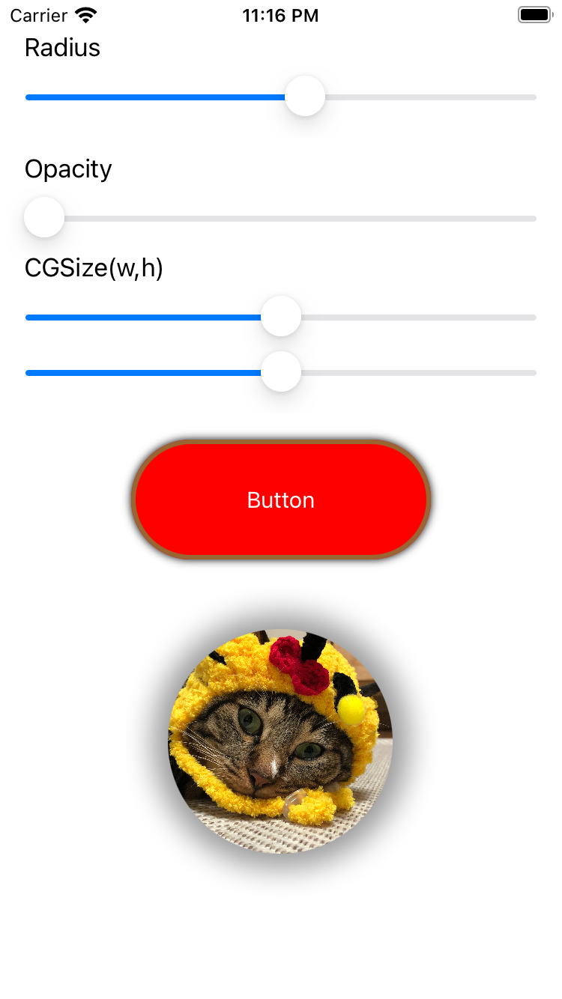

# CALayer

>Reference Raywenderlich CALayers

## What are CALayer
잘 알듯이 UIKit에서 모든 뷰는 UIView를 통해서 그려진다. UIButton, UIImage 등등 그러나 이것들이 직접적으로 스크린에 그리는 동작을 하지는 않는다. 대신 뒤에서 CALayer라는 것을 호출하여 스크린에 어떻게 표시할 것인지 결정한다.

CALayer는 그래픽 하드웨어로 전달된다. DrawRect 메소드를 통해 무언가를 그릴 때 뷰의 레이어 프로퍼티에 접근할 수 있다.

레이어는 델리게이트 프로퍼티를 가지고 있다.레이어가 무언가를 드로잉 할 타이밍이 되면 레이어는 자기자신에게 스크린에 그릴 콘텐츠 버퍼를 요청한다. 그리고 레이어가 실제로 뷰의 DrawRect를 호출하게 된다. 드로잉 코드를 버퍼에 넣고 하드웨어로 전달되게 된다.

이것이 레이어가 어떻게 랜더링 되는지에 대한 기본 개념이며 뷰는 레이어의 래퍼 역할을 하게 된다.

## Why Use CALayers
1. CALayers 에 CA는 코어 애니메이션을 뜻한다. 거의 모든 프로퍼티들이 자동으로 애니메이트 된다.
2. 굉장히 많은 편리한 프로퍼티들이 있다. 그림자, 스트로크 등
3. 쉬운 코드로 쓸 수 있다.
4. 최적화가 잘 되어 있다. 직접 CoreGraphics를 시도하는 것 보다 효율적일 수 있다.
5. 쉬운 Flat image를 만들 수 있다. 

## Layer Basic
- 모든 뷰는 레이어를 가지고 있다.
- 레이어는 유용한 프로퍼티들을 가지고 있다.
- 레이어 프로퍼티들은 애니메이트 된다.
- 많은 서브클래스가 있다. CAShape, CAgradient 등
- 기본 레이어 클래스는 CALayer이지만 바꿀 수 있다.
- 레이어는 서브 레이어도 가질 수 있다.

## CALayer Properties
- cornerRadius : 코너를 둥글게 만든다.
- borderWidth, borderColor
- Shadows
- Mask
- Contents
- And more...

## CornerRadius
- 뷰의 코너를 둥글게 만들 수 있다.
```Swift
button.layer.cornerRadius = 10
```
view의 layer.cornerRadius로 접글할 수 있다. 값은 CGFloat, 값의 크기에 따라 코너의 라운딩이 얼마나 커지는 냐는 아래 그림을 통해 알 수 있다.


높이 100pt의 어떤 뷰가 있다고 했을 때 cornerRadius의 값 20은 반지름 20짜리의 원이 코너에 있다고 생각하면 된다. 그 원의 아크만큼 뷰가 깍여 나간다.

이를 좀더 깊게 생각해보면
원의 반지름이 뷰의 높이의 절반이 되면 어떻게 될까?


이런식으로 차지하게 된다. 즉 완전히 캡슐 모양의 뷰가 된다.

|1|2|
|:-:|:-:|
|||
|`button.layer.cornerRadius = 10`|`button.layer.cornerRadius = button.frame.height / 2`|

## BorderColor, BorderWidth
- 뷰 경계의 컬러를 결정한다. 만약 경계 컬러를 정했는데 보이지 않는다면 BorderWidth값이 없기 때문이다.
```Swift
button.layer.borderWidth = 3
button.layer.borderColor = UIColor.brown.cgColor
```


## Shadow
- 뷰에 그림자를 추가할 수 있다.

### shadowRadius, shadowOpacity, shadowOffset
각각 그림으로 보는게 이해하기 쉬울 것
|shadowRadius|shadowOpacity|shadowOffset|
|:-:|:-:|:-:|
||||

```Swift
button.layer.shadowRadius = 3.0
button.layer.shadowOpacity = 0.5
button.layer.shadowOffset = CGSize(width: 0, height: 0)
```

### !
한가지 이미지뷰에 그림자가 안먹기 때문에 다음과 같은 트릭을 사용한다.
1. 이미지 뷰를 뷰로 감싼다.
2. 아래 코드를 추가한다
```Swift
extension UIImageView {
  func applyshadowWithCorner(containerView : UIView, cornerRadious : CGFloat){
    containerView.clipsToBounds = false
    containerView.layer.shadowColor = UIColor.black.cgColor
    containerView.layer.shadowOpacity = 0.4
    containerView.layer.shadowOffset = CGSize.zero
    containerView.layer.shadowRadius = 10
    containerView.layer.cornerRadius = cornerRadious
    containerView.layer.shadowPath = UIBezierPath(roundedRect: containerView.bounds, cornerRadius: cornerRadious).cgPath
    self.clipsToBounds = true
    self.layer.cornerRadius = cornerRadious
  }
}
```


## CAGradientLayer

CAGradientLayer는 프레임의 0,0을 기준으로 1, 1까지로 해서 startPoint와 endPoint를 가지고 그 안에서 컬러가 결정된다.
```Swift
leyerGradient.colors = [
  UIColor.black.cgColor,
  UIColor.red.cgColor,
  UIColor.white.cgColor
]
layerGradient.startPoint = CGPoint(x: 0.25, y: 0.25)
layerGradient.endPoint = CGPoint(x: 0.75, y: 0.75)
```
위와 같이 코드를 작성하면 검은색, 빨간색, 흰색 3가지 컬러가 왼쪽 위에서 오른쪽 아래로 그라데이션 하게 들어간다.
이들 경계선의 선명도는

`Locations`을 통해 상세하게 정해줄 수 있다.

```Swift
layerGradient.locations = [0, 0.8, 1]
```

## Layers and Sublayers
레이어는 서브레이어를 가질 수 있다.
그래서 CAGradientLayer를 선언하고 적용하고자 하는 뷰 레이어에 추가해버리면 된다.
```Swift
let layerGradient = CAGradientLayer()
layer.addSublayer(layerGradient)
```

## ShouldRasterize와 DrawsAsynchronously를 사용한 성능 향상
- `CALayer`는 성능 향상을 위한 두가지 프로퍼티들이 있는데 바로 `ShouldRasterize`와 `DrawsAsynchronousl`가 각각 그렇다.
`shouldRasterize`는 기본적으로 false이며 true로 설정하면 레이어의 내용이 단 한번만 렌더링 된다. 한번 정해진 뒤 고정되는 개체에 적합하다.
`drawsAsynchronously`는 `shouldRasterize`의 반대 속성으로 디폴트는 마찬가지로 false이다. 앱이 레이어의 콘텐츠를 다시 그려야 할 때 성능을 향상시키기 위해 true로 설정할 수 있다. 예를 들어 애니메이션 요소를 지속적으로 렌더링 해야하는 레이어 작업을 해야 할 때 사용할 수 있다.

## CAScrollLayer
`CAScrollLayer`는 이름부터 알 수 있듯이 스크롤을 가능하게 하는 레이어이다. 스크롤뷰랑 같은거 아니야? 라고 생각할지 모르지만 CAScrollLayer는 스크롤 뷰를 전혀 사용하지 않느 방법이다.!


- 우선 UIView를 상속하는 ScrollingView를 선언하고
```Swift
class ScrollingView: UIView {
  override class var layerClass: AnyClass {
    return CAScrollLayer.self
  }
}

```

- ViewController에서는 다음과 같은 작업을 수행한다.
```Swift
var scrollingViewLayer: CAScrollLayer {
    // swiftlint:disable:next force_cast
    return scrollingView.layer as! CAScrollLayer
  }

  override func viewDidLoad() {
    super.viewDidLoad()
    scrollingViewLayer.scrollMode = .both
  }
```

그다음 panGesture를 추가해서
```Swift
@IBAction func panRecognized(_ sender: UIPanGestureRecognizer) {
    var newPoint = scrollingView.bounds.origin
    newPoint.x -= sender.translation(in: scrollingView).x
    newPoint.y -= sender.translation(in: scrollingView).y
    sender.setTranslation(.zero, in: scrollingView)
    scrollingViewLayer.scroll(to: newPoint)
    
    if sender.state == .ended {
      UIView.animate(withDuration: 0.3) {
        self.scrollingViewLayer.scroll(CGPoint.zero)
      }
    }
  }
```
스크롤링 뷰에 추가된 탭 제스처가 스크롤 위치를 계산한 다음 해당 계산 결과로 scrollingViewLayer를 스크롤 하는 방식이다.
고 아래에는 스크롤이 끝나면 원래 포인트로 돌아오는 작업으로 scroll자체에는 animation 효과가 없으므로 추가

- 가벼운 것을 원하고, 프로그래밍 방식으로만 스크롤 해야 하는 경우 이 스크롤 레이어를 사용해볼 수 있겠다.
- 물론 유저가 스크롤해야 하는 UI환경에서는 UIScrollView를 쓰자
- 매우 큰 이미지를 스크롤 하는 경우 CATiledLayer를 사용해볼 수 있다.
