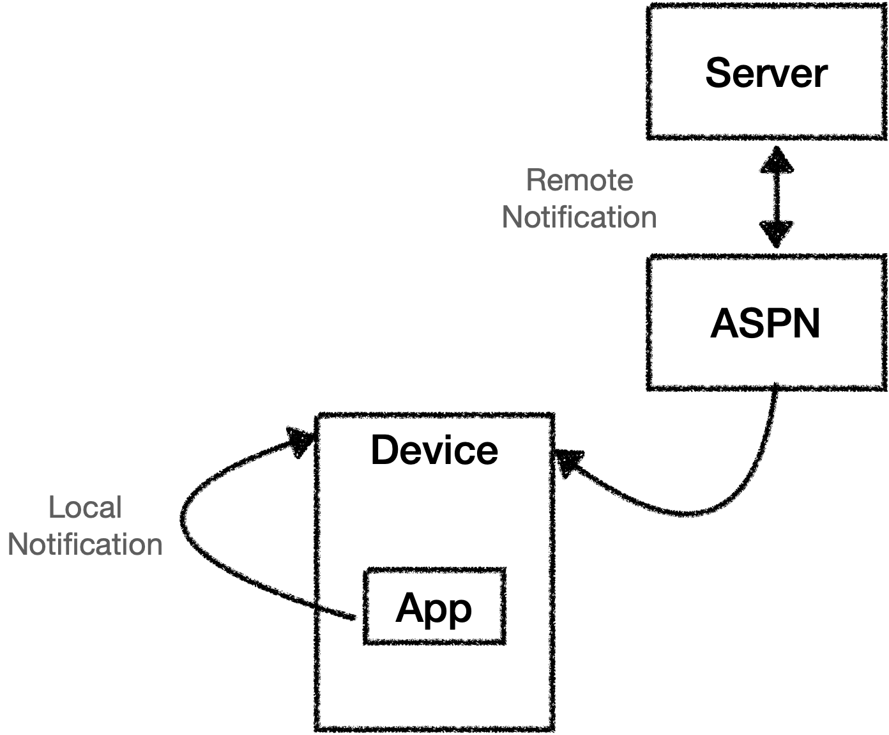
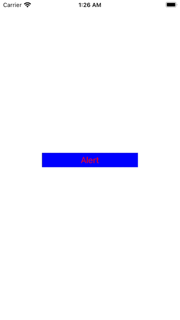
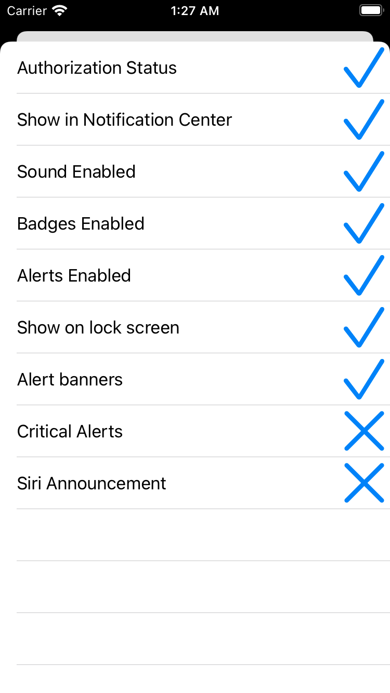
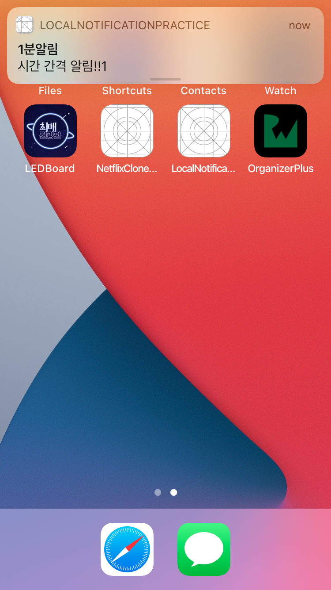
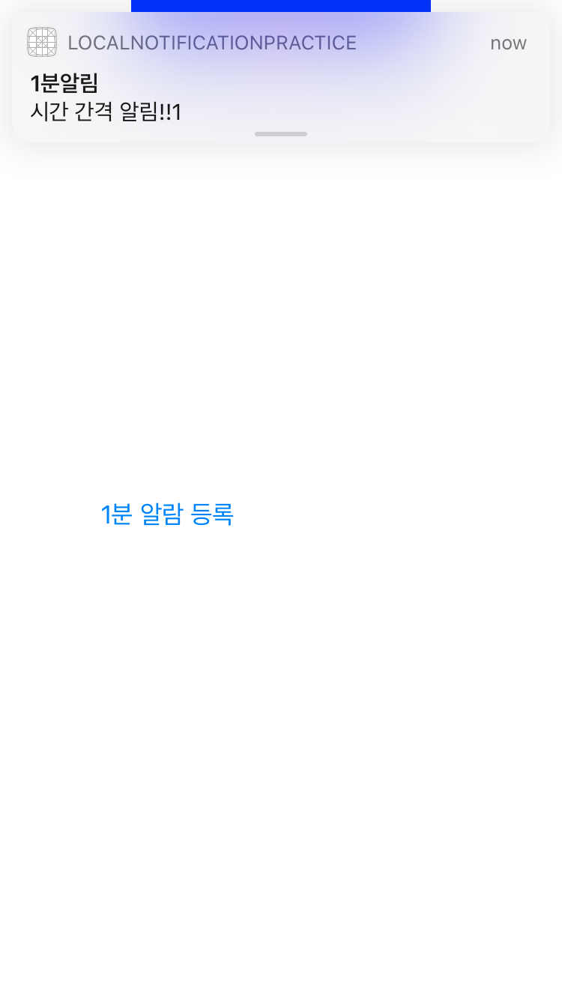

# Local Notification

Notification은 디바이스 사용자에게 정보를 전달하는 방법으로 사용자의 관심을 끌거나 앱을 사용하도록 유도하는데 도움이 된다.  하지만 과도한 알람은 앱 사용 경험을 크게 하락 시킬 수 있고 그로인해 앱을 삭제하는 계기로 이어질 수 있다. 현명하고, 정확하게 Notification을 사용 해보도록 하자.

Notification에는 Remote와 Local 두가지 유형으로 나뉜다. 이번 글에서는 Local에 대해서 다루어 본다.

Local Notification은 크게 3파트로 나누어 볼 수 있다.

- 알림에 대한 권한 요청
- 다양한 유형의 로컬 알람을 생성, 예약 및 관리
- 알림 작업 처리

# Notification

앞서 얘기했듯 Notification에는 Local과 Remote가 있다. Local은 사용하는 앱에서 알림을 예약하고 구성하는 반면 Remote는 APNS(Apple Push Notification Service)를 사용하여 원격 알림을 보낸다. 



절차는 다르지만 이들 Notification 모두 UserNotifications 프레임워크를 통해 구성할 수 있다. Remote Notification은 Push Notification를 키워드로 검색해보면 자료가 나온다.

Notification을 만들고 관리하기 위한 단계는 다음과 같다.

- 권한 부여
- 콘텐츠 제작
- 알림 예약
- 알림 관리
- 처리 작업

# 알림 권한 요청

앱을 많이 사용하면서 느끼겠지만 앱은 사용자에게 우선 알림을 허용할 것인지에 대한 동의를 얻어야 한다. 알림은 유익하게 사용될 수 있으면서도 불필요한 알림은 오히려 사용자를 방해할 수 있기 때문

알림 권한 요청 코드는 아래 와 같다.

```swift
func requestAuthorization(completion: @escaping (Bool) -> Void) {
    UNUserNotificationCenter.current()
      .requestAuthorization(options: [.alert, .sound, .badge]) { granted, _ in
        // Fetch notification  settings
        completion(granted)
      }
  }
```

- `UNUserNotificationCenter` : 앱의 모든 알림 관련 기능을 처리한다. 여기에는 권한 요청, 스케줄 전달, 동작 수행등이 포함된다. `current()`를 호출하여 UNUserNotificationCenter의 shard instance에 접근할 수 있다.
- `requestAuthorization(options:completionHandler:)` 를 호출하여 알림에 관한 권한을 요청한다. 옵션으로 알림 표시, 알림 사운드, 앱 배지 업데이트와 같은 알림 동작을 나타낸다. 이외에도 carPlay, criticalAlert, providedAppNotificationSettings, privosional 이 있다. 자세한 내용은 [개발자 문서 참고](https://developer.apple.com/documentation/usernotifications/unauthorizationoptions)
- `CompletionHandler` 는 사용자가 권한을 부여했는지에 대한 Boolean값을 수신한다. 해당 Boolean값을 통해 핸들러를 호출한다.

그 다음은 Notification Setting을 fetch하는 메소드

```swift
func fetchNotificationSettings() {
    UNUserNotificationCenter.current().getNotificationSettings { settings in
      DispatchQueue.main.async {
        self.settings = settings
      }
    }
  }
```

- `UNUserNotificationCanter` 의 `getNotificationSettings(completionHandler:)` 는 앱에서 승인한 알림 설정을 요청한다. 설정은 비동기적으로 반환된다.
- `UNNotificationSettings`은 모든 알림 관련 설정과 앱의 승인 상태를 관리한다.
- Completion 블록은 백그라운드 스레드에서 호출될 수 있다. 여기서 값을 업데이트 하면 UI가 업데이트 되므로 메인 스레드의 설정 프로퍼티를 업데이트 한다.

이제 위에서 작성한 fetchNotificationSettings를 requestAutorization의 헨들러 안에서 호출해주면 된다.

```swift
func requestAuthorization(completion: @escaping (Bool) -> Void) {
    UNUserNotificationCenter.current()
      .requestAuthorization(options: [.alert, .sound, .badge]) { granted, _ in
        self.fetchNotificationSettings()
        completion(granted)
      }
  }
```

# 알람 승인 요청 호출하기

위에서 작성한 `requestAuthorization`을 호출하는 법은 간단하다. 

```swift
@objc func showRequestNotification() {
    NotificationManager.shared.requestAuthorization { granted in
      if granted {
        DispatchQueue.main.sync {
          self.performSegue(withIdentifier: "NotificationSettingsViewController", sender: nil)
        }
      }
    }
  }
```

특정 버튼을 눌렀을 때 requestAuthorization을 호출하고 granted가 true 일 때 관련 작업을 해주면 된다.

SwiftUI에서는 현재 뷰에서 시트 presnet로 호출해도 별 문제 없는데 UIKit에서는 클로저 안에서 뷰 전환을 시도하는 것은 메인 스레드에서 해야 한다고 혼났다. 그래서 메인 스레드에서 호출하려고 코드를 짰는데 테이블 뷰 상태가 좀 이상하다 ㅋㅋ





테이블 뷰가 didSelect에 reloadData를 호출했더니 정상적으로 표시가 되는데 그 전에는 체크 표시가 갱신이 안된다.

아무튼.

## Critical Alerts

크리티컬 알람은 현재 X 마크로 즉 권한이 없음을 나타내고 있다. 왜냐하면 Critical Alerts는 건강, 의료, 보안, 공공 안전을 목적으로 하는 알림으로 이러한 알람은 방해금지 모드 또는 무음모드를 무시하고 알람을 발생시킨다. 재난문자오면 핸드폰이 뺴에에엑 하고 울리는 그 알람이다. 아무 앱이나 이 권한을 얻을 수는 없고 Apple Develover forum에서 자격을 따로 신청할 수 있다.

# 알림 생성하기

알림은 다음 트리거 중 하나를 선택하여 로컬 알림을 만들고 예약할 수 있다.

- 시간 간격 (Time Interval)
- 달력 (Calendar)
- 위치정보 (Location)

## TimeInterval Alert Trigger

TimeInterval 을 이용한 알림 트리거는 말 그대로 시간에 관계된 트리거로 몇초뒤, 몇분뒤 와 같은 알림을 설정할 수 있다.

`NotificationManager` 에 다음과 같은 메소드를 추가한다

```swift
//1
  func scheduleNotification(task: Task) {
    //2
    let content = UNMutableNotificationContent()
    content.title = task.name
    content.body = "시간 간격 알림!!"
    
    //3
    var trigger: UNNotificationTrigger?
    switch task.reminder.reminderType {
    case .time:
      if let timeInterval = task.reminder.timeInterval {
        trigger = UNTimeIntervalNotificationTrigger(timeInterval: timeInterval, repeats: task.reminder.repeats)
      }
    default:
      return
    }
    
    //4
    if let trigger = trigger {
      let request = UNNotificationRequest(identifier: task.id, content: content, trigger: trigger)
      //5
      UNUserNotificationCenter.current().add(request) { error in
        if let error = error {
          print(error)
        }
      }
    }
  }
```

1. scheduleNotification은 task를 매개변수로 받는다. Task는 Task.swift에 별도로 정의한 모델로 알람의 타입과 설정을 정의하고 있다.
2. 알림 콘텐츠에 표시될 내용으로 `UNMutableNotificationContent()`를 통해 생성된다. 현재는 title과 body만 사용했는데 이외에도
    - subtitle: 알림에 대한 보조설명
    - badge: 앱의 아이콘 배지에 표시할 수
    - sound: 소리
    - Attachments: 알림에 표시할 첨부 파일의 배열로 이미지, 비디오, 오디오 파일이  될 수 있다.
    
    가 존재한다.
    
3. 어떤 트리거에 의해서 반응할지 설정하는 것으로 이번에는 TimeInterval을 트리거로 하기 때문에 `UNTimeIntervalNotificationTrigger` 를 통해서 설정한다. task.reminder니 깊게 보지 말고 핵심은 UNTimeIntervalNotificationTrigger이며 이 메소드는 timeInterval과 반복 여부에 대한 매개변수를 받는다.
4. 트리거 정의 후 `UNNotificationRequest` 를 통해 **알림 요청**을 생성하는 것으로 알림 요청에는 알림의 고유 ID와 앞서 만든 콘텐츠, 트리거로 생성하게 된다. 이렇게 알림 요청이 생성된 것을
5. `UNNotificationCenter.current()` 에 add(request)하는 것으로 알림에 최종적으로 예약된다. 해당 메소드는 error 핸들링 클로져가 따라온다.

코드를 다시 정리하자면

1. `UNMutableNotificationContent()` 로 알림 콘텐츠를 작성
2. `UNTimeIntervalNotificationTrigger` 알림 트리거 결정 (이 경우 TimeInterval)
3. `UNNotificationRequest` 알림 요청 등록
4. `UNNotificationCenter.current().add(request)` 알림 예약

단계로 이루어 진다는 것만 확실히 기억하자.

이제 `NotificationManager.shared.scheduleNotification(task: task)` 하여 알림을 생성할 수 있다.

```swift
@IBAction func oneMinueAlert() {
    let reminder = Reminder(timeInterval: 60, date: nil, location: nil, reminderType: .time, repeats: false)
    let task = Task(name: "1분알림", reminder: reminder)
    
    let alert = UIAlertController(title: "알림", message: "알림이 1분뒤에 예약되었습니다.", preferredStyle: .alert)
    let ok = UIAlertAction(title: "확인", style: .default, handler: nil)
    alert.addAction(ok)
    present(alert, animated: true, completion: nil)
    
    NotificationManager.shared.scheduleNotification(task: task)
  }
```

해당 기능을 뷰컨트롤러든 어디 추가해서 실행시킨 뒤 앱을 백그라운드로 돌려놓자.



1분뒤 사진과 같이 알림이 왔다

기본적으로 알림은 앱이 foreground에 있을 때는 오지 않는다. 하지만 불가능한 것은 아니다.

## Foreground 알림

Foreground에서의 알림은 `UNUserNotificationCenterDelegate`를 통해서 가능하다.

Delegate는 AppDelegate에 선언할꺼다.

```swift
extension AppDelegate: UNUserNotificationCenterDelegate {
  func userNotificationCenter(_ center: UNUserNotificationCenter, willPresent notification: UNNotification, withCompletionHandler completionHandler: @escaping (UNNotificationPresentationOptions) -> Void) {
    if #available(iOS 14.0, *) {
      completionHandler(.banner)
    } else {
      completionHandler(.alert)
    }
  }
}
```

- `userNotificationCenter(_:willPresent:withCompletionHandler:)` 를 통해서 이루어 지는데 completionHandler에 .banner는 iOS 14.0이상 부터만 쓸 수 있다. 그 전에는 .alert로 해야 한다.

그 다음 Delegate 설정

```swift
private func configureUserNotifications() {
    UNUserNotificationCenter.current().delegate = self
}
```

```swift
func application(_ application: UIApplication, didFinishLaunchingWithOptions launchOptions: [UIApplication.LaunchOptionsKey: Any]?) -> Bool {
    configureUserNotifications()
    return true
}
```

- UNUserNotificationCenter.current().delegete를 self로 연결하는 코드를 작성한다.

이제 foreground에 남아있으면 알림이 어떻게 발생하는지 보자



iOS 14.0 미만일 때 알람이 어떻게 보이는지 보고 싶은데 본인 xcode 버그로 13.0은 다운로드가 안된다.

어쨋든 중요한 것은 Foreground에서도 발생시킬 수 있다는 것

## 알림 제거하기

여태 알림을 예약해 두었는데 알림 제거는 어떻게 하는 것일까?

`removePendingNotificationRequests(withIdentifers:)` 를 사용해서 아까 생성한 task의 id를 전달해서 삭제할 수 있다. identifiers를 통해 삭제하므로 생성한 알림의 id는 꼭 저장되는 형태로 구현하자.

이외에도

`removeAllPendingNotificationRequests()` 을 사용해서 예약은 되어있고 보류중인 모든 알림을 제거할 수도 있다.

`removeAllDeliveredNotifications()` 는 그냥 모든 전달된 알림을 제거한다.

## Calendar 알림 트리거

내일이나 모레의 몇시 몇분에 알림은 어떻게 해야할까? TimeInterval로 시간을 초단위로 계산해서 전달하면 가능은 하겠지만 친절하게도 Calendar Trigger를 별도로 제공하고 이 트리거는 Calendar를 통해서 년,월,일,시,분 까지 지정할 수 있다.

```swift
case .calendar:
      if let date = task.reminder.date {
        trigger = UNCalendarNotificationTrigger(dateMatching: Calendar.current.dateComponents([.day, .month, .year, .hour, .month], from: date), repeats: task.reminder.repeats)
      }
```

아까 만들었던 `scheduleNotification(task: Task)`에 위와같이 캘린더 케이스를 전달할 수 있겠다. 물론 Trigger 부분만 유심히 봐도 된다.

DatePicker를 통해서 값을 전달해서 호출 사용하면 된다.

## Location 알림 트리거

Location 알림 트리거를 쓰기 위해서는 우선 위치정보에 대한 권한 요청이 필요하다. 이는 이미 되어있다고 가정하겠다.

```swift
case .location:
      guard CLLocationManager().authorizationStatus == .authorizedWhenInUse else { return }
      if let location = task.reminder.location {
        let center = CLLocationCoordinate2D(latitude: location.latitude, longitude: location.longitude)
        let region = CLCircularRegion(center: center, radius: location.radius, identifier: task.id)
        trigger = UNLocationNotificationTrigger(region: region, repeats: task.reminder.repeats)
      }
```

마찬가지로 `UNLocationNotificationTrigger` 를 통해서 생성 가능하며 CoreLocation의 region을 전달하게 된다. 그래서 예를 들어 유저 정보에 집 좌표를 등록해 놓고 반경 범위 안으로 들어오면 알림이 가도록 할 수 있겠다.

# 알림 그룹화

알림 그룹은 그거다. 카톡 수십개가 오면 수십개의 카톡을 개별로 알림을 줄줄이 표시해주는 것이 아니라 카카오톡에서 알림이 총 몇개 있다로 묶어서 표시해주는 기능으로

기본적으로는 앱의 번들 ID를 기반으로 모든 앱의 알림을 그룹화 하지만 앱에 대한 사용자 지정 그룹을 만들 수도 있다. 

가장 간단하게 예를 들어보자면 지금 TimeInterval, Calendar, Location에 대한 트리거를 이용해 알림을 만들었는데 이러한 트리거에 따라 알림을 그룹 지을 수 있다. TimeInterval은 TimeInterval 끼리, Calendar는 Calendar 끼리 알림이 묶이게 된다.

이는 `UNMutableNotificationContent()` 에 `.threadIdentifier` 프로퍼티로 작성된다. 동일한 문자열 값을 가진 알림끼리 묶이게 된다.

# Handling Notification Actions

Notification Actions은 사용자가 예를들어 알림에 의해 발생한 배너를 눌렀을 때 단순히 앱으로 돌아오는 것이 아닌 추가적인 동작을 수행할 수 있다.

예를들어 자체적으로 만든 미리알림 어플에서 매일 오후 3시 30분에 버스를 타러 나가야 한다고 알림을 예약해 두었다고 하자. 3시 30분에 알림이 발생하고 나는 해당 알림을 보고 집을 나선다.

그러나 버스를 타고 업무를 수행하다 보니 해당 미리알림 앱에는 내가 알림을 무시하고 버스를 타러 나가지 않았다고 기록이 될것이다. (테스트 완료)

집에서 나가는 일은 굉장히 급한 일이므로 도중에 나는 알림의 배너를 누르고 앱을 켜서 테스크를 완료할 여유가 없었던 것이다.

Notification Actions은 배너를 눌러서 앱을 들어오게 되면 자동으로 해당 테스크를 완료해주는 기능을 넣어볼 수 있다!

Action가능한 알림을 생성하기 위해서는 다음 프로세스를 수행해야 한다.

1. 앱 실행시 알림 카테고리 선언
2. 알림 카테코리에 작업을 만들고 할당
3. 알림 페이로드에 카테고리 ID 할당
4. 등록된 작업 처리

앞서 Foreground에서 알림을 동작하기 위해 AppDelegate에 `configureUserNotifications()` 메소드를 작성했던 것을 기억할 것이다. delegate 이후에 다음 코드를 작성해보자

```swift
// 1
let dismissAction = UNNotificationAction(
  identifier: "dismiss",
  title: "Dismiss",
  options: [])
let markAsDone = UNNotificationAction(
 identifier: "markAsDone",
 title: "Mark As Done",
 options: [])
// 2
let category = UNNotificationCategory(
 identifier: "YOURAPPNAME",
 actions: [dismissAction, markAsDone],
 intentIdentifiers: [],
 options: [])
// 3
UNUserNotificationCenter.current().setNotificationCategories([category])
```

1. 두 가지 작업을 선언 해볼 것으로 dismissAction은 단순히 알림의 사라짐 동작, markAsDone은 해당 작업을 수행한 것으로 동작을 줄 것이다. 두 작업은 모두 `UNNotificationAction` 을 통해서 등록할 수 있다. 이 과정에서 각각 아이디와 타이틀을 등록한다. 타이들은 해당 알림의 배너를 눌렀을 때 표시된다. 현재 옵션은 없지만 다음과 같은 옵션을 줄 수 있다.
    - autenticationRequired: 알림 액션을 잠금 해제된 경우에만 수행 가능하도록 하는 옵션으로 잠금 상태에서 배너를 누르면 잠금 해제를 요청한다.
    - destructive: 해당 동작이 파괴적인 동작이라는 것을 명시한다. Alert과 마찬가지로 해당 옵션을 키면 배너를 눌렀을 때 해당 동작이 하이라이팅 되어 표시된다.
    - foreground: 해당 기능이 foreground에서도 수행될 수 있다.
2. `UNNotificationCategory` 를 통해 카테고리를 설정한다. 카테고리 아이디는 우선 앱 번들 네임으로 하고, actions에 앞서 생성했던 액션을 모두 등록한다., intentIdentifiers는 시리 요청과 관련이 있다., 옵션은 알림을 처리하는 방법을 나타낸다. 유용한 옵션인지는 잘 모르겠지만 필요하다면 [개발자 문서](https://developer.apple.com/documentation/usernotifications/unnotificationcategoryoptions)를 보아 사용토록 하자
3. `UNUserNotificationCenter.current().setNotificationCetegories([category])` 최종적으로 앞서 생성한 카테고리를 등록하게 된다.

## 알림 페이로드에 ID 할당

category 선언시 작성했던 identifier는 알림의 Content.categoryIdentifier에 전달하면 된다.

그런다음 작업 내용을 content.userInfo에 키 값 쌍으로 전달하면 된다.!

아까 만들었던 `scheduleNotification(task:)` 메소드 콘텐츠 선언 부분에 추가하도록 하자!

```swift
content.categoryIdentifier = "YOURAPPNAME"
let taskData = try? JSONEncoder().encode(task)
if let taskData = taskData {
  content.userInfo = ["Task": taskData]
}
```

## 액션 핸들링

마지막으로 액션의 핸들링은 Foreground에서 알림 동작을 했던 것처럼 AppDelegate에서 NotifiactionDelegate로 작성하게 된다.

```swift
// 1
func userNotificationCenter(
  _ center: UNUserNotificationCenter,
  didReceive response: UNNotificationResponse,
  withCompletionHandler completionHandler: @escaping () -> Void
) {
  // 2
  if response.actionIdentifier == "markAsDone" {
    let userInfo = response.notification.request.content.userInfo
    if let taskData = userInfo["Task"] as? Data {
      if let task = try? JSONDecoder().decode(Task.self, from: taskData) {
        // 3
        TaskManager.shared.remove(task: task)
      }
    }
  }
  completionHandler()
}
```

1. `userNotificationCenter(_:didReceive:withCompletionHandler:)` 유저가 배너에서 액션을 수행 했을 때 이 방법으로 앱이 실행된다.
2. 사용자의 응답이 `response.actionIdentifier` 로 전달된다. 그런 다음 해당 동작을 `response.notification.request.content.userInfo` 디코드 해온다.
3. decode가 성공하면 해당 데이터를 작업 완료로 수행할 수 있다. `TaskManager.shared.remove(task: task)` 는 앱에서 미리 알림에 대한 작업 수행을 의미한다.

# ...

로컬 알림만 해도 내용이 꽤 많다. Push Notification은 얼마나 사용 케이스가 많을지 두렵다. ㅎ