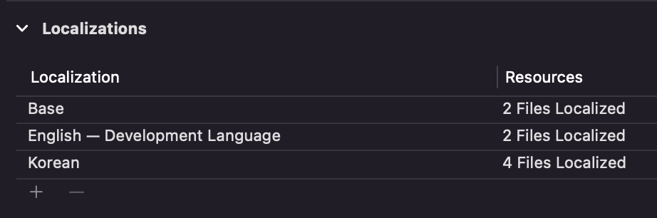
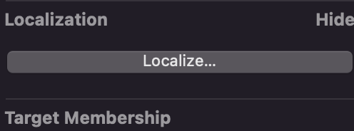
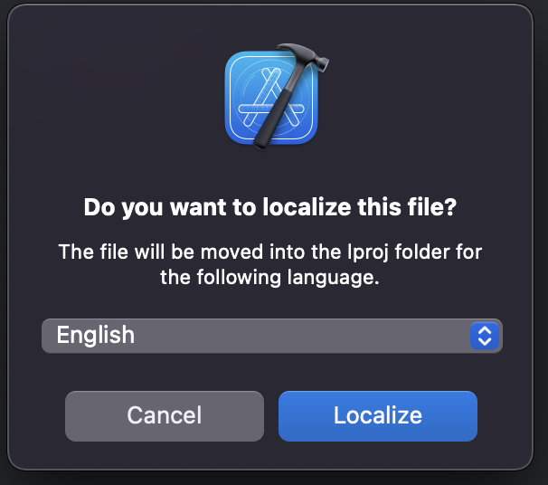
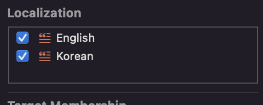

# Localization

- 어플리케이션을 다양한 언어 설정에 맞게 대응하는 것을 `Localization`이라고 한다.
- `국제화`와 용어가 혼용될 수 있는데 국제화는 좀더 구체적으로 정의를 내려보자면 아래와 같다.
  - 하드웨어, 소프트웨어 등의 제품을 언어, 문화권이 다른 환경에서 사용할 수 있도록 지원하는 서비스
  - 사용자가 선택한 기기의 기본 언어에 따라 이루어짐
  - 문화적/환경적인 측면을 고려함

# Apple의 국제화(현지화) 시스템
- Apple API를 활용해 날짜, 길이, 무게, 가격 및 통화 기호와 같이 사용자에게 표시되거나 동적으로 생성되는 값을 모든 로케일에 올바르게 표현할 수 있게 구현
  - 국내와 해외의 날짜 표현 방식, 표준시 차이
  - 숫자 단위의 표현 차이
- 앱에서 사용되는 언어
  - `Localizable.strings` 를 작성해 각 나라와 지역에 맞는 정적 메시지(고정된 텍스트를 제공)
  - `InfoPlist.strings` 를 작성해, 각 나라와 지역에 맞는 권한 요청 문구를 출력
  - `plural.stringsdict` 를 작성해, 각 나라와 지역에 맞는 표현 단위 등을 출력, 언어에 따라 순서가 다르거나 단수나 복수, 숫자 표현 대응이 예시로 있음
- 앱스토어의 메타 데이터
  - 앱의 현지화와 상관없이, 앱스토어 제품 페이지의 메타데이터 내용을 현지화할 수 있다.
  - 단, 앱의 기본 언어 설정의 경우 프로젝트에서 메시지 설정파일(Localizable.strings)대응이 된 국가 중 선태 까능
  - 앱의 기본 언어 설정

# 국제화(Internationalization)
- 앱이 특정 국가나 지역에 종속되지 않도록, 호환성을 위해 앱을 설계하는 과정
- 언어 번역 뿐만 아니라, 국가별 쓰기 방향의 차이, 숫자, 화폐, 날짜 등의 표기 방법, 시간대 등을 고려해 앱을 설계하는 과정
- 이런 설계와 코드를 통해 앱이 현지와(localized)될 수 있음
- i18n
  - Internationalization의 약어
  - multligual system

# 현지화(Localization)
- l10n
  - Localization의 약어
  - 그 국가와 지역에 맞게 앱을 번역하고 리소스 작업을 하는 등 적합하게 구현
  - 날자와 시간 표현을 할 때, 그 나라에 맞는 형식으료 표현


# Localization 수행하기

## 타겟 언어 설정

App - Project - Info - Locatlizations 에서 응하고자 하는 언어를 추가함

## Localizable.strings 파일 생성
Localizable.strings는 A는 B로 번역한다는 데이터가 담긴 파일로 Localizable은 기본값이므로 나중에 별도의 `tableName` 줄 수 있기는 하지만 기본값의 경우 Localizable이기 때문에 틀리면 안됨


- `localizable.strings`파일의 file inspector를 보면 사진과 같은 항목이 있는데 `Localize...` 버튼을 누른다.


- 그러면 다음과 같은 윈도우가 나오는데 별건 아니고, 정말 지역화 할꺼냐는 일종의 알림문이고, 아래 드롭다운 메뉴에서는 기본으로할 언어를 선택하면 된다., 한국어를 기준으로 먼저 작업한 뒤 영어를 추가하면 되므로, 한국어를 선택하고 localize하자
(드롭다운에서 표시되는 언어는 처음에 타겟 언어 설정할 때 설정한 언어만 표시가 된다.)

- Localizable.strings 파일 내용은 아래와 같다.
```Swift
"search" = "검색";
"calendar" = "캘린더";
"setting" = "설정";
"writeDiary" = "일기쓰기";
"pleaseTypingTitle" = "제목을 입력해주세요";
"saveBar" = "저장";
"dateString" = "yyyy년 MM월 dd일";
```
이런식으로 `search`라는 키는 `검색`으로 번역된다는 뜻이다. 



- 파일 인스펙터를 보면 사진의 경우 English, Korean모두 체크 되어 있는데 아마 위 설정대로 했으면 Korean만 설정되어 있다., 앱 UI가 완성되었을 즘 Localizable.strings를 완성하고 English를 체크하게 되면 프로젝트 네비게이터에서 다음과 같이 보인다.


- 여태 작성한 내용은 Korean 파일에 모두 작성되어있고, 이 때 English 파일에는 Korean파일에 작성된 것 과 같은 똑같은 내용이 있다. 값을 영어로 번역해주면 된다. 이를 굳이 English를 나중에 체크하는 이유인데, UI가 끝나고, korean Localizable파일 작성이 다 띁난 다음에 하면 코드를 일일이 다시 작성하는 불편함을 없앨 수 있다.

## Localizable.strings 사용하기
- 예를들어 
```Swift
titleLabel.text = "Hello SeSAC!"
```
이라고 한다면 기존에는 텍스트에 String을 직접 기입을 해줬을 것이다. 
이 작업을 이제 Localizable 파일에서 설정한 키값을 전달해주게 될 것인데

Localizable.strings에 
```Swift
"greeting" = "안녕 SeSAC!"
```
이라고 작성이 되어있다고 하면

```Swift
titleLabel.text = NSLocalizedString("greeting", comment: "Greeting")
```
이렇게 작성해주면 해당 `NSLocalizedString` 메소드가 `Localizable.strings`의 `greeting`이라는 키를 참고해 `안녕 SeSAC`라는 값을 가져온다. 만약 Localizable.strings (English)파일에는

```Swift
"greeting" = "Hello SeSAC!"
```
라고 되어있다면 앱 언어설정이 영어로 되어있다면 자동으로 Hello SeSAC!으로 가져올 것이다.

- String extension으로 코드 단축하기
```Swift
extension String {
  func localized(tableName: String = "Localizable") -> String {
    NSLocalizedString(self, tableName: tableName, bundle: .main, value: "", comment: self)
  }
}
```
- 위와 같이 코드를 작성해서 문자열을 작성할 때 시간을 단축 해볼 수 있다
tableName은 Localizable.strings의 파일 이름이 들어가게 되는데 Localizable이 디폴트 이고, 다른 지역화 strings를 나누어서 사용하고 싶다면 그 파일명을 tableName으로 전달해 주면 된다.

## InfoPlist.strings
- 권한 요청에 대한 알림을 띄울 때 나오는 Description의 경우도 지역화를 해야 하는데 이 때 지역화 strings파일 이름도 `InfoPlist`로 정해져 있다. 해당 파일 이름으로 똑같이 strings파일을 만들고 지역화를 한다.
- 이때 키 값은 info.plist에 있는 키값을 사용해야 하는데 info.plist를 source code로 열어 키값을 확인하는게 좋다.
```Swift
NSPhotoLibraryUsageDescription = "일기에 사진을 활용하기 위해, 사진 앨범 접근에 대한 권한이 필요합니다.";
NSCameraUsageDescription = "일기에 사진을 활용하기 위해, 카메라 접근에 대한 권한이 필요합니다.";
```
