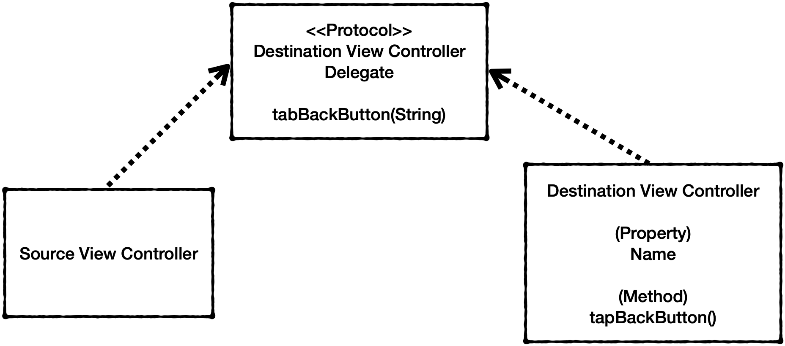
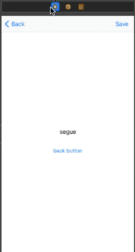

# 뷰 컨트롤러간 데이터 전달하기

UIKit에서 뷰 컨트롤러간 데이터를 전달하는 방법은 대표적으로 `Delegate`와 `Unwind Segue`를 사용하는 방법이 있다. `Diffable DataSource`라는 개념도 있는데 이건 어려워서 나중에 따로 공부한다.

우선 Delegate는 UIKit iOS에서 전반적으로 쓰이는 디자인 패턴으로 잘 쓰는게 UIKit 자체를 이해하는데 큰 도움이 된다.

## Delegate



그림을 제대로 그렸는지 모르겠는데 Delegate를 통한 데이터 전달은 위 도식처럼 이루어진다.
Destination View Controller에서는 메소드와 전달할 프로퍼티를 가지고 있고

이를 전달하는 방법은 Destination View Controller Delegate에 위임한다.

자세한 방법은 코드를 통해 보자

```Swift
import UIKit

//1. Delegate 프로토콜!
protocol DestinationViewControllerDelegate: AnyObject {
  func DestinationViewController(_ controller: DestinationViewController, tapBackButton segueType: String)
}

class DestinationViewController: UIViewController {
  
  @IBOutlet weak var segueTypeLabel: UILabel!
  
  var segueType: String!
  //2. 프로퍼티로 Delegate 선언
  weak var delegate: DestinationViewControllerDelegate?
  
  override func viewDidLoad() {
    super.viewDidLoad()
    segueTypeLabel.text = segueType
  }
  
  @IBAction func tapBackButton() {
    if segueType == "Push Segue" || segueType == "Code Push" {
      //3. Delegate 메소드 호출
      delegate?.DestinationViewController(self, tapBackButton: segueType)
      self.navigationController?.popViewController(animated: true)
    } else if segueType == "Present Segue" || segueType == "Code Present" {
      delegate?.DestinationViewController(self, tapBackButton: segueType)
      self.presentingViewController?.dismiss(animated: true, completion: nil)
    }
  }
}
```

파트를 크게 3개로 나누어서 보면

1. Delegate Protocol : 뷰 컨트롤러의 델리게이트를 프로토콜로 정의한다. 외부 VC에서는 tapBackButton 메소드를 중간다리로 사용한다.
2. delegate : 델리게이트를 뷰 컨트롤러에서 소유한다. 이때 꼭 약한 참조로 할것
3. DestinationVC에서 델리게이트로 전달하는 액션을 결정한다. 이 경우 tabBackButton을 누르면 외부에서 Delegate에 전달하는 타이밍을 결정한다.

이를 Source View Controller에서는 delegate를 소유하는 시점을 결정하고 델리게이트 메소드를 호출해서 델리게이트로 받은 데이터를 어떻게 사용할 것인지 어느 시점에서 사용할 것인지 결정한다.

```Swift
import UIKit

class ViewController: UIViewController {

  @IBOutlet weak var receiveTypeLabel: UILabel!
  var receiveType: String?
  ...

}

extension ViewController: DestinationViewControllerDelegate {
  func DestinationViewController(_ controller: DestinationViewController, tapBackButton segueType: String) {
    receiveType = segueType
  }
}
```

우선 데이터를 간단하게 표시할 UILabel과 문자열 프로퍼티 `receiveType`을 선언한다.

그리고 현재 뷰 컨트롤러에서 DestinationViewControllerDelegate protocol를 extension으로 채용한다.

DestinavtionViewController에서는 해당 델리게이트 메소드를 통해 segueType을 전달했고 SourceViewController는 그를 통해 데이터를 받는다.

코드만 보면 이렇게만 해도 동작할 것 같지만 실제로는 그렇지 않은데 아직 현재 VC에서 DestinationVC의 델리게이트를 소유할 거라는 선언을 안해서 안된다.

```Swift
override func prepare(for segue: UIStoryboardSegue, sender: Any?) {
  if segue.identifier == "PresentSegue" {
    let controller = segue.destination as! DestinationViewController
    controller.segueType = "Present Segue"
    controller.delegate = self
    ...
  }
}
```
SourceVC에서 DestinationVC를 호출하는 시점에 delegate를 소유하는 것이 일반적이다.

그리고 문자열 데이터를 receiveType으로 받기는 했는데 레이블로 갱신을 안했다.

일반적으로 화면이 호출될 때 label을 갱신하면 될 것 같은데

```Swift
  override func viewWillAppear(_ animated: Bool) {
    super.viewWillAppear(animated)
    if let receiveType = receiveType {
      receiveTypeLabel.text = receiveType
      receiveTypeLabel.sizeToFit()
    }
}
```
이 경우 한가지 맹점은 만약 DestinationVC가 popover 형태로 호출 되었으면 SourceVC에서는 어떠한 라이프사이클 메소드도 호출되지 않는다. 그렇기 때문에 데이터는 받아서 레이블은 업데이트 되지 않는데 Swift에서는 운좋게도 Observable Property를 제공한다.

```Swift
import UIKit

class ViewController: UIViewController {

  @IBOutlet weak var receiveTypeLabel: UILabel!
  var receiveType: String?  {
    didSet{
      if let receiveType == receiveType {
        receiveTypeLabel.text = receiveType
        receiveTypeLabel.sizeToFit()
      }
    }
  }
  ...
}
```
이렇게 해주면 receiveType이 변경될 때 마다 레이블을 갱신할 수 있게 된다.

## UnwindSegue

이 방법은 Segue를 통해서 Destination VC에 데이터를 보냈 듯이 Segue를 통해 Source VC에 데이터를 보내는 방법이다. Action Segue를 이용하는 방법과 코드를 작성하는 방법이 있다.

우선 Source VC에 IBAction 메소드를 작성해야 한다.

```Swift
  @IBAction func receiveTypeData(unwindSegue: UIStoryboardSegue) {
    guard let destinationViewController = unwindSegue.source as? DestinationViewController, let segueType = destinationViewController.segueType else { return }
    receiveType = segueType
  }
  ```
  destinationVC에서 데이터를 가져와 receiveType에 segueType을 저장한다.

  해당 메소드를 IBAction으로 작성하게 되면 이제 Storyboard에서 
  Destination View Controller에서 Exit로 우클릭 드래그앤 드랍 한다.

  
  그러면 Document Navigator에 Unwind segue ~~라는 이름으로 segue가 생성된다

  이 녀석을 클릭하고 Attribute Inspector에서 identifier를 설정 예를들어 `ReceiveDataSegue`로 설정 하고

  이제 DestinationVC에서 해당 Segue를 perform할 조건을 만들어 주면 된다.

Bar button item으로 save를 추가해서 이를 IBAction으로 DestinationViewController 페이지에 추가한다.

그리고 IBAction 내용

```Swift
  @IBAction func saveButton(_ sender: Any) {
    performSegue(withIdentifier: "ReceiveDataSegue", sender: nil)
  }
```
이렇게 하면 해당 버튼을 누르면 `ReceviceDataSegue`라는 이름의 Segue(이 경우 Unwind Segue)가 동작하고 source VC에서 정의한 UnwindSegue 메소드가 동작한다.

Action Segue를 이용하는 방법은 어렵지 않은데

위에서 페이지내에 saveButton이라는 메소드를 작성할 필요는 없고
스토리보드에서 해당 save버튼을 바로 Exit 아이콘으로 드래그앤 드랍하면
Source VC에서 정의한 Unwind Segue가 보인다. 연겨해주면
performSegue없이 바로 동작하게 된다.

## 정리

Delegate 방법으로도 가능한지는 모르겠는데 지금 예제의 경우는 단 두개의 VC만 있지만 VC 계층이 많이 쌓이게 되어서 가장 마지막 VC에서 가장 처음 VC로 한번에 되돌아 가고자 할 때 Unwind Segue를 사용하게 되면 단번에 돌아갈 수 있다. 왜냐하면 Unwind Segue는 Receive 측에서 정의하기 때문이다.
